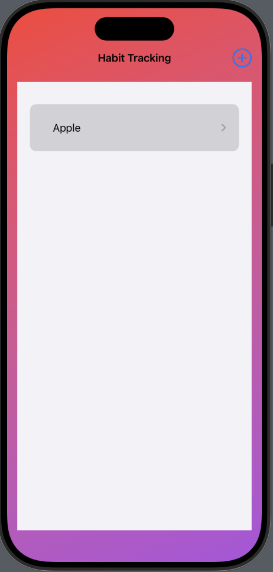

# **Momentum - Habit-Tracking App**

## **Overview**
Momentum is a habit-tracking app designed to help users build consistency and achieve their goals. It allows users to log activities, track completion counts, and visualize progress. With a user-friendly interface and persistent data storage using `UserDefaults`, Momentum ensures that your habits are always accessible.

## **Features**

### **Current Features**
- **Add New Habits:** Easily create habits and assign categories to organize them (e.g., Health, Productivity, Leisure).  
- **Track Progress:** Increment or decrement the completion count for each habit to reflect your daily activity.  
- **Categorization:** Group habits into categories for better organization and clarity.  
- **Persistence:** Habits and their data are saved locally using `UserDefaults` and remain intact even after closing the app.  
- **Intuitive Design:** A minimalist design ensures a smooth and distraction-free experience.

### **Planned Features**
- **User Authentication:** Allow users to sign up, log in, and sync their habits across devices with Firebase or CoreData.  
- **Notifications:** Set reminders to complete habits and stay on track.  
- **Detailed Analytics:** Visualize trends, track streaks, and measure long-term progress.  
- **Customizable Themes:** Enable users to personalize the app's look and feel.  
- **Widget Support:** Add habit tracking directly to the iOS home screen.

## **How to Run the App**
1. Clone or download this repository.  
2. Open the project in Xcode.  
3. Ensure your system meets the requirements:  
   - Xcode 12.0 or later  
   - iOS 14.0 or later  
4. Build and run the app on an iOS simulator or a physical device.

## **Requirements**
- **Development Environment:** Xcode 12.0 or later  
- **Supported Devices:** iPhone running iOS 14.0 or later  

## **App Demo**

### **Screenshots**
- **App Icon:**  
  

- **Habit List View:**  
  

- **Habit Details Page:**  
  

- **Add Habit Screen:**  
  

## **Development**

### **Technologies Used**
- **SwiftUI:** For building the app’s user interface  
- **Combine:** For reactive programming and managing data flow between views  
- **UserDefaults:** For lightweight, local data persistence  

### **Architecture**
Momentum follows the MVVM (Model-View-ViewModel) architecture to separate concerns and ensure maintainable, testable code.  

### **Key Components**
- **`Activity` Model:** Represents a habit, including its title, description, category, and completion count.  
- **`ActivityStore`:** A centralized data store for managing the list of activities.  
- **SwiftUI Views:** Leverage declarative UI for seamless layout and interactions.  

## **Contributing**
Pull requests are welcome. For major changes, please open an issue first to discuss what you would like to change.  

## **License**
This project is licensed under the MIT License - see the [LICENSE](./LICENSE) file for details.
